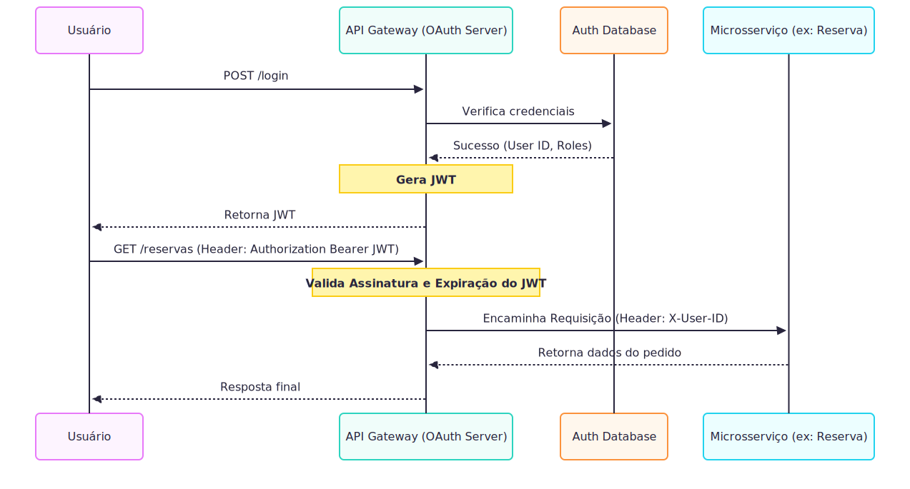

# EventMaster: Relatório Técnico

## Resumo
O projeto **EventMaster** visa a transição de um sistema de venda de ingressos monolítico para uma arquitetura de microsserviços. Essa evolução busca solucionar problemas críticos de latência durante picos de acesso, inconsistência na base de dados de ingressos e vulnerabilidades de segurança (injeção de dados). O projeto foi desenhado sob os princípios de Arquitetura Limpa, Domain-Driven Design (DDD) e padrões de resiliência e sistemas distribuídos.

Como prova de conceito (PoC) da nova arquitetura, este repositório contém o esqueleto arquitetural das camadas de domínio e aplicação e a implementação completa do microsserviço de Vendas e Pagamentos (`sales-service`).

---

## Estrutura do Grupo e Divisão de Papéis

Para abordar a complexidade do sistema, o projeto foi segmentado em três papéis principais. O esqueleto da solução em código foca na integração dos Papéis 2 e 3, enquanto o Papel 1 fornece a infraestrutura de design e mitigação de vulnerabilidades.

1. **Infraestrutura e Segurança (Papel 1):** Responsável pelo roteamento de tráfego, resiliência na borda e blindagem da aplicação (Diagramas de Transição, OAuth 2.0 / JWT, Mitigação OWASP Top 10).
2. **Domínio e Arquitetura Limpa (Papel 2 - Implementado no Core Backend):** Focado na modelagem do negócio, isolamento de regras na camada de domínio utilizando DDD, princípios SOLID e o padrão *Strategy*.
3. **Sistemas Distribuídos e Dados (Papel 3 - Implementado em Integration & Data):** Focado na consistência com o padrão SAGA (Orquestração), comunicação assíncrona (Kafka), *Circuit Breaker* para resiliência externa e topologia de processamento de alto volume.

---

## 1. Fase de Design e Estrutura (Papel 1: Infraestrutura e Segurança)

A migração utiliza o **Padrão de Estrangulamento (Strangler Fig Pattern)** para extrair funcionalidades gradativamente do Monolito.

### 1.1 A Arquitetura Monolítica (Legado)
No modelo original de desenvolvimento, todos os módulos eram fortemente acoplados, partilhando o mesmo tempo de execução e base de dados. Um pico no acesso de ingressos poderia afetar as consultas de relatórios simultaneamente, causando indisponibilidade geral da plataforma.

<div align="center">
  
</div>

### 1.2 Nova Arquitetura de Microsserviços
A nova estrutura incorpora instâncias separadas e independentes utilizando um Gateway como única porta de entrada.

<div align="center">
  
</div>

Três componentes críticos são desenhados para a sustentação e escalabilidade:
*   **API Gateway:** Ponto unificado que resolve o problema de exposição direta. Ele implementa **Segurança Centralizada** para interceptar acessos indevidos antes mesmo de baterem nos microsserviços e **Rate Limiting** para impedir efeitos de manada de milhares de milhares usuários ou *bots*.
*   **Circuit Breaker:** Proteção contra falhas em agentes externos. Retorna um erro amigável ao usuário quando o gateway de pagamento terceirizado está fora do ar.
*   **Service Discovery:** Mantém um registro dinâmico do endereço das aplicações ativas frente às mudanças constantes de IP nos nós do cluster.

### 1.3 Fluxo de Autenticação (OAuth 2.0 + JWT)
O API Gateway funciona também como o Authorization Server que regula a emissão e validação.

<div align="center">
  
</div>

### 1.4 Segurança por Design (OWASP Top 10)
A arquitetura base se defende ativamente das seguintes vulnerabilidades:
*   **A01:2021-Broken Access Control:** O Gateway atua ativamente validando as permissões nos subdomínios, garantindo que usuários possuam credenciais restritas logadas (Ex: Apenas um cliente pode ver seu próprio pedido).
*   **A03:2021-Injection:** Validação estrita de *schemas de input* em todas as pontas para impedir injeção de scripts (XSS/SQL).
*   **Zero Trust:** Exigência do uso de *mTLS* para chamadas internas do cluster, garantindo que microsserviços confiem unicamente nos pares validados por certificados.

---

## 2. Fase de Aplicação (Papel 2: Domínio e Arquitetura Limpa)

A arquitetura orientada para o microsserviço `sales-service` aplica os conceitos de Arquitetura Limpa (Robert C. Martin), alocando todas as regras fundamentais do negócio de blindadas para evitar mutabilidade descontrolada.

### 2.1 Modelagem DDD — Contextos Delimitados

```text
┌─────────────────────────┐     ┌─────────────────────────────┐
│  Catálogo de Eventos    │     │  Vendas e Pagamentos        │
│  (Bounded Context 1)    │     │  (Bounded Context 2)        │
│                         │     │                             │
│  • Event                │     │  • Order  (Aggregate Root)  │
│  • Venue                │◄───►│  • OrderItem                │
│  • TicketType           │     │  • OrderStatus              │
│  • Disponibilidade      │     │  • PaymentGateway (Strategy)│
└─────────────────────────┘     └─────────────────────────────┘
```

A **Entidade Principal (Aggregate Root)** é a `Order`. Ela atua como um portão centralizando todas as validações de carrinho limpo e transições de estado restritas (ex: `CREATED → CONFIRMED → PAID`), evitando fraudes de pagamento em estados indevidos.

### 2.2 Clean Architecture e Justificativas

```text
┌──────────────────────────────────────────────┐
│  Infrastructure (adapters: REST, db mem, pag)│
├──────────────────────────────────────────────┤
│  Application (use cases + ports)             │
├──────────────────────────────────────────────┤
│  Domain (entities + regras de negócio puras) │
└──────────────────────────────────────────────┘
```

| Decisão | Motivo |
|---|---|
| **Domínio sem dependências externas** | A camada de domínio opera sem frameworks. Facilita manutenções rápidas e refatoração do ambiente. |
| **Portas (Interfaces) em Application** | O modelo usa abstrações via Portas (`OrderRepositoryPort`) para acessar recursos de banco que podem um dia variar de Mongo para Postgres através do DIP. |
| **Adaptadores em Infrastructure** | Componentes periféricos REST Controller ou de Pagamentos substituíveis se adaptam em volta das interfaces. |
| **Commands como Dados Imutáveis** | Entradas operadas em blocos atômicos evitam colisão de multithreading. |

### 2.3 Design Pattern: Strategy no Pagamento

Foi inserido o *Design Pattern Strategy* em conjunto ao Princípio *Open/Closed (OCP)* para separar lógicas entre meios de pagamentos instáveis (*Credit Card*) vs. mais confiáveis (*Pix* e *Boleto*).

```text
         ┌─────────────────────┐
         │ PaymentGatewayPort  │  ← Interface (Strategy)
         └──────┬──────────────┘
                │
    ┌───────────┼───────────────┐
┌───▼───┐  ┌───▼────┐  ┌───────▼──┐
│  Pix  │  │ Credit │  │  Boleto  │  ← Strategies concretas
└───────┘  └────────┘  └──────────┘
```
Para integrar um novo modelo de pagamento (como Apple Pay), não se deve modificar a inteligência do processamento financeiro no core do sistema, apenas constrói-se e registra-se localmente a nova porta de strategy concreta.

### 2.4 Testes Unitários Baseados em TDD
Cobrindo a Base da Pirâmide:
*   `OrderTest` e `OrderItemTest`: Regras puramente de negócios, restrição de subtotais.
*   `CreateOrderServiceTest`: Operando injeções por *stubs*, as validações limitam-se as respostas de orquestração interna e comportamentos estritos da *Application Layer*.

---

## 3. Fase de Integração (Papel 3: Sistemas Distribuídos)

A parte final foca em gerir o alto volume massivo de requisições de pagamentos e a inconsistência eventual perante as perdas de requisição no inventário, consolidando a prova de conceito.

### 3.1 Padrão SAGA Distribuído (Orquestração)

Pela exigência temporal de uma venda de um ingresso, não utilizamos Two-Phase Commit e optamos diretamente pela **Orquestração** mantendo o Maestro responsável no `ProcessPaymentService`.

```text
 ┌───────────────────────┐         ┌─────────────────────────┐
 │   Catálogo/Estoque    │         │   Vendas e Pagamentos   │
 │   (Bounded Context 1) │         │   (Bounded Context 2)   │
 └───────────▲───────────┘         └────────────┬────────────┘
             │                                  │
             │ 1. Reserva Ingresso              │ 2. Processa Pagamento
             │ (Lock)                           │ (CreditCard/Pix)
             │                                  ▼
 ┌───────────┴───────────┐         ┌─────────────────────────┐
 │     Message Broker    │◄────────┤  Orquestrador (SAGA)    │
 │     (Apache Kafka)    │ 3. Pub  │  ProcessPaymentService  │
 └───────────────────────┘         └─────────────────────────┘
      ▲             │
      │ 4. Consome  │ (Se falhar: ticket-compensation-topic)
      └─────────────┘ (Se sucesso: order-completed-topic)
```

No caminho de falha de compensação bancária (Gateway de pagamento fora do ar/Saldo inválido), o Orquestrador imediatamente emite o `CompensationEvent` (`RELEASE_LOCK`). O microsserviço acoplado de catálogo recebe este evento revertendo a reserva e liberando a vaga no banco sem bloquear ou interromper os usuários com sucesso em sua finalização.

### 3.2 Topologia de Processamento e Dados

| Natureza de Operação | Tecnologia | Caso de Uso Arquitetural |
| --- | --- | --- |
| **Stream (Tempo Real)** | Apache Kafka | Eventos e Fila de Retenção de Venda. Trabalha absorvendo o pico esporádico das transações distribuídas (Ex: Abertura relâmpago). |
| **Batch (Em Lotes)** | Rotinas Cron | Repassa na madrugada os relatórios e faturamentos dos lojistas, operando num horário mais limpo e amigável sem derrubar APIs. |

### 3.3 Resiliência (Circuit Breaker) e Fail Fast
Implementado em nível de código via *Resilience4j*, blindamos as falhas que advém do `CreditCardPaymentGateway`. O Threshold do sistema estourando 50% de taxa de falha interrompe e abre o circuito. A próxima requisição sofre o Fallback (Retorno Imediato Negativo - *Fail Fast*), ativando imediatamente a Orquestração do Rollback do Ingresso e salvando a plataforma EventMaster de exaustão massiva de conexões *Threads*.

### 3.4 BDD (Testes de Comportamento Integrado)
No topo da pirâmide está o Cucumber (Gherkin): os testes abordados em sublinguagem de domínio traçam roteiros estritos com simulação controlada no `MockMessageBroker`. Ali atesta-se, através de injeção *Spring*, se o componente *Resilience4j* opera em união harmoniosa e reativa aos *Topics* em instabilidades controladas.
